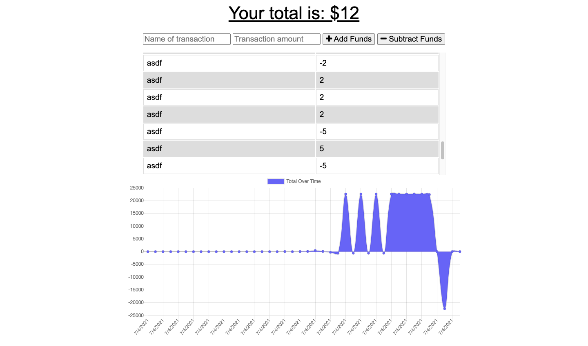

# Budget Tracker (Progressive Web Application)

## Description

Budgeting app with offline functionality using a service worker and web manifest.

## Challenges

There's a bug that I don't know how to fix. The app has a timeout of a few seconds when posting transactions online. After a few seconds, no more transactions can be posted. Also, the state is not maintained on refresh. :(
Works fine offline though.

## Deployed application

https://rugged-lake-clark-40284.herokuapp.com/

## Screenshot

